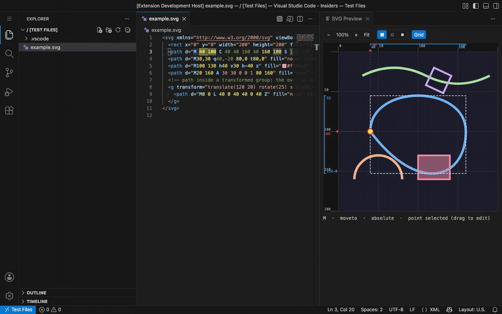
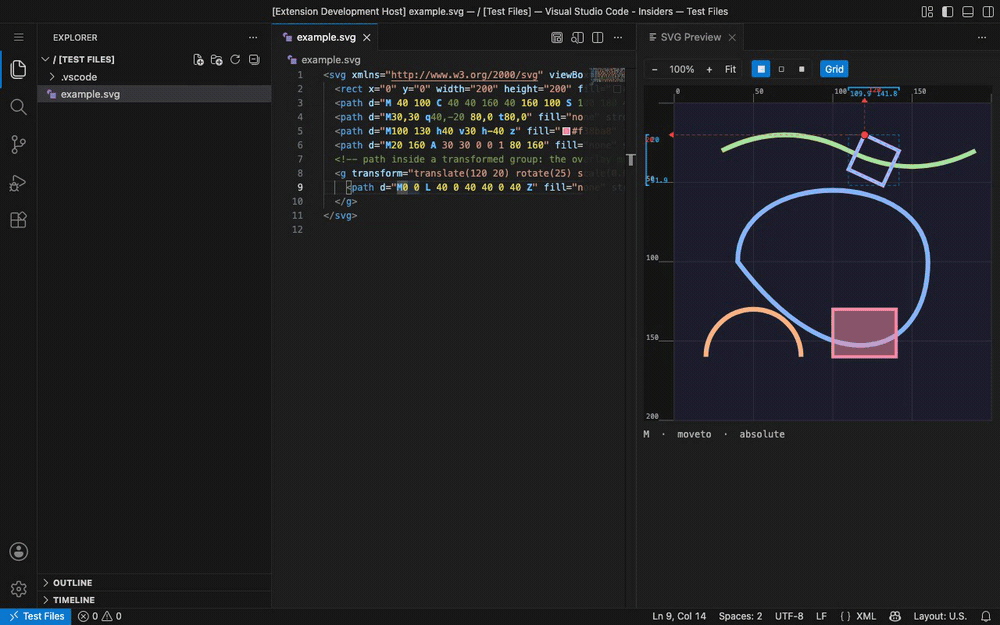
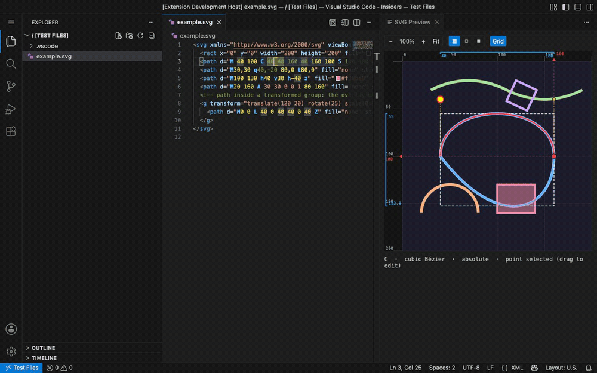

# SVG Path Helper

[](https://github.com/zazaulola/svg-path-helper/actions/workflows/ci.yml)
[](https://marketplace.visualstudio.com/items?itemName=zazaulola.svg-path-helper)
[](https://marketplace.visualstudio.com/items?itemName=zazaulola.svg-path-helper)
[](https://open-vsx.org/extension/zazaulola/svg-path-helper)

A VS Code extension for hand-writing and editing SVG paths: a live preview that
highlights the path segment under your cursor, cursor-aware syntax colouring
inside `<path d="…">`, draggable points, and absolute⇄relative conversion. Runs
in desktop VS Code **and in the browser** — vscode.dev, github.dev, code-server.


*As the cursor sweeps through `<path d="…">`, the editor decorations and the
preview overlay update together — command letters, end-point / control-point
coordinates, the current segment, the selected point, control handles, and the
calibrated rulers. Captured live from the extension running in VS Code for the Web.*

## Features

### Live preview
The preview opens automatically beside an `.svg` file (or run `SVG Path: Open
Preview` / click the preview icon in the editor title bar). A toolbar gives you
**zoom** (− / % / + / Fit), the **background** (checkerboard / light / dark), and
a **grid** toggle. Driven by the cursor position, the preview overlays:

- the **element under the cursor** — move the cursor onto any tag (`<rect>`,
  `<circle>`, `<g>`, …) and its oriented bounding box is outlined;
- the **current path** (faint blue outline);
- the **current segment** (red, thick);
- the **points of the current segment** — end point (red) and control points
  (orange, with dashed handles);
- the **selected point** (yellow, enlarged) when the cursor is on a coordinate.



*The preview toolbar — zoom (− / % / + / Fit), background (checkerboard / light /
dark), and the grid + rulers toggle.*

**Click to select:** click an object in the preview to select its full opening
tag — and the matching closing tag, if any — in the editor; right-click to get a
menu of the whole stack of objects under the pointer (hover an entry to
highlight it), so you can reach an element hidden behind others.

The overlay is drawn through each path element's live CTM, so it tracks the
geometry **through parent `<g transform>`s and the path's own transform** —
translate, rotate, scale, skew, nested, all of it:



*The purple square lives inside `<g transform="translate(120 20) rotate(25)
scale(0.6)">`. As the cursor moves along its `d`, the overlay (outline, segment,
selected corner) stays locked to the rendered, rotated-and-scaled shape.*

### Opening SVG files
VS Code opens `.svg` files in its built-in **Image Preview** by default, which
has no source text for this extension to work on. To keep editing fluid:

- the **`SVG Path: Open Preview`** button reopens the current image-preview tab
  as source code, then opens the preview beside it;
- while the preview is open, picking another `.svg` in the Explorer reopens it
  as source too, so the preview keeps following it — built-in image preview
  only, third-party SVG editors are left alone
  (`svgPathHelper.openSvgFilesAsSource`);
- the preview's editor group is **locked** so files you open from the Explorer
  land in your code column instead of on top of the preview
  (`svgPathHelper.lockPreviewGroup`);
- a view-only **SVG Path Studio Preview** is offered under **Open With…**
  (right-click an `.svg` → *Open With*) — it shows the same preview as a tab and
  never changes your default `.svg` editor; click an element in it to open the
  source and select that element.

### Rulers & coordinate readout
Top and left rulers are calibrated to the root `viewBox` coordinate space and
indicate, with guide lines projected toward the rulers:

- the **bounding box of the whole current path** (cyan bracket + dashed box);
- the **current segment's next (end) point** (red caret + crosshair);
- the **live mouse position** (yellow caret + crosshair).

The mouse coordinates are also shown in a corner badge. For paths inside a
transform the indicators are projected into root coordinates, so the rulers stay
truthful even when the geometry is rotated or scaled (see the second screenshot).

### Cursor-aware syntax highlighting
Inside every `<path d="…">` the extension colours:

- segment **command letters** (`M`, `C`, `q`, …);
- the **coordinates of each end point** (one colour) and **control points**
  (another colour);
- the **segment under the cursor** (background highlight);
- the **point coordinates under the cursor** (strong highlight + bold).

These are editor *decorations*, recomputed live — they react to cursor movement,
which a static TextMate grammar cannot do.

### Drag points in the preview
Grab any point of the current segment in the preview and drag it — the matching
coordinate in the `d` attribute updates. The drag is committed as a **single
undo step** on release, and the cursor lands on the coordinate you edited.
Relative segments receive a delta from the segment start; `H`/`V` edit a single
number; arcs keep their `rx ry rotation large-arc sweep` flags.



*Dragging a cubic's control handle: the curve deforms live (with a coordinate
badge) and the matching number in `d` is rewritten as a single undo step on release.*

### Absolute / relative conversion
Right-click in an `.svg`/XML/HTML file (or use the command palette):

- **Convert selected path(s) to Absolute coordinates** — easier for working
  with individual points.
- **Convert selected path(s) to Relative coordinates** — easier for moving
  groups of segments around.

Every `<path>` whose `d` attribute is touched by a selection (or contains a
cursor) is converted. Command kinds are preserved (`S` stays `S`, `H` stays
`H`); only letter case and numbers change. The first moveto is always kept
absolute, per the SVG convention.

### Transform operations
Put the cursor on a `transform="…"` attribute value (or select it) and
right-click — four commands appear:

1. **Convert this transform to `matrix()`** — collapse the transform list
   (`translate`/`scale`/`rotate`/`skewX`/`skewY`/`matrix`) of this element to a
   single `matrix(a b c d e f)`.
2. **Convert to `matrix()` (incl. nested)** — same, plus every descendant's own
   transform.
3. **Resolve (bake into geometry)** — make the transform disappear by applying
   it to the content. The element (and basic shapes — `rect`, `circle`,
   `ellipse`, `line`, `polyline`, `polygon`) becomes a transform-free `<path>`;
   on a `<g>` the transform is pushed one level into the direct children
   (nested transforms are preserved, composed). Styling (presentation
   attributes + inline `style`) is carried over.
4. **Resolve (incl. nested)** — recursively flatten the whole subtree so no
   transforms remain anywhere; all shapes become baked `<path>`s.

```xml
<!-- before: cursor on the transform value, "Resolve" -->
<rect transform="translate(20 20) rotate(15)" x="0" y="0" width="50" height="30" rx="6" fill="#89b4fa"/>
<!-- after -->
<path fill="#89b4fa" d="M 25.8 25.2 A 6 6 0 0 1 ... Z"/>
```

Arcs are transformed correctly under any affine matrix (rotation, non-uniform
scale, skew, reflection) via a closed-form transform of the arc's ellipse;
`H`/`V` are preserved under axis-aligned matrices and become `L` otherwise.
Open `example-transforms.svg` to try it.

## Develop / run

```bash
npm install
npm run build      # or: npm run watch
npm test           # unit tests (node:test + tsx)
```

Then press **F5** ("Run SVG Path Helper") to launch an Extension Development
Host, open `example.svg`, run **SVG Path: Open Preview**, and move the cursor
through a `d` attribute (or drag a point in the preview).

`npm run build` bundles the extension for both the Node and the browser
extension hosts (`dist/extension.js` + `dist/web/extension.js`). The static
figures come from `tools/gen-demo.ts` (the real `media/preview.*` + parser, shot
with headless Chrome); the animated demos are captured from the **real extension
running in web VS Code** by `tools/screencast.mjs` (`@vscode/test-web` +
Playwright → GIF/APNG).

## Settings

| Setting | Default | Description |
| --- | --- | --- |
| `svgPathHelper.precision` | `6` | Fractional digits kept when converting/dragging. |
| `svgPathHelper.autoOpenPreview` | `true` | Auto-open the preview beside an `.svg` file. |
| `svgPathHelper.lockPreviewGroup` | `true` | Lock the preview's editor group so Explorer opens go to the code column, not over the preview. |
| `svgPathHelper.openSvgFilesAsSource` | `true` | While the preview is open, open `.svg` files from the Explorer as source instead of the built-in image preview. |
| `svgPathHelper.preview.background` | `checker` | Default preview background (`checker`/`light`/`dark`). |
| `svgPathHelper.preview.showGrid` | `true` | Show the coordinate grid & rulers by default. |
| `svgPathHelper.colors.command` | `#4fc1ff` | Command letter colour. |
| `svgPathHelper.colors.endpoint` | `#e8d44d` | End-point coordinate colour. |
| `svgPathHelper.colors.control` | `#6a9955` | Control-point coordinate colour. |
| `svgPathHelper.colors.segmentBg` | `rgba(120,170,255,0.13)` | Current-segment background. |
| `svgPathHelper.colors.pointBg` | `rgba(255,220,0,0.30)` | Current-point background. |

## Supported path commands

`M L H V C S Q T A Z` in both absolute and relative forms, including implicit
repeated arguments (e.g. `M0 0 1 1 2 2`), smooth-curve control-point reflection
(`S`/`T`), and arc flag parsing.

## Known limitations

- The preview renders the document's outer `<svg>`. Inline SVG inside HTML/JSX,
  and files with several `<svg>` blocks, are handled as the first/outer one.

## Releasing

CI builds a `.vsix` on every run (downloadable from the run's artifacts).
Pushing a version tag publishes it:

```bash
npm version patch          # bump package.json version + create the tag
git push --follow-tags     # triggers .github/workflows/publish.yml
```

The publish workflow packages the extension and pushes it to the VS Code
Marketplace and Open VSX, then creates a GitHub Release with the `.vsix`. Set
the repo secrets `VSCE_PAT` (Marketplace) and/or `OVSX_PAT` (Open VSX) first;
whichever is missing is skipped.

## License

MIT
