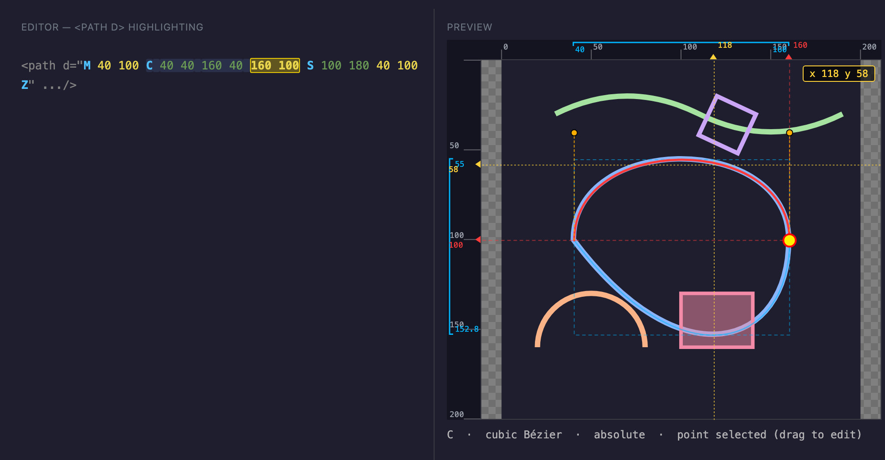
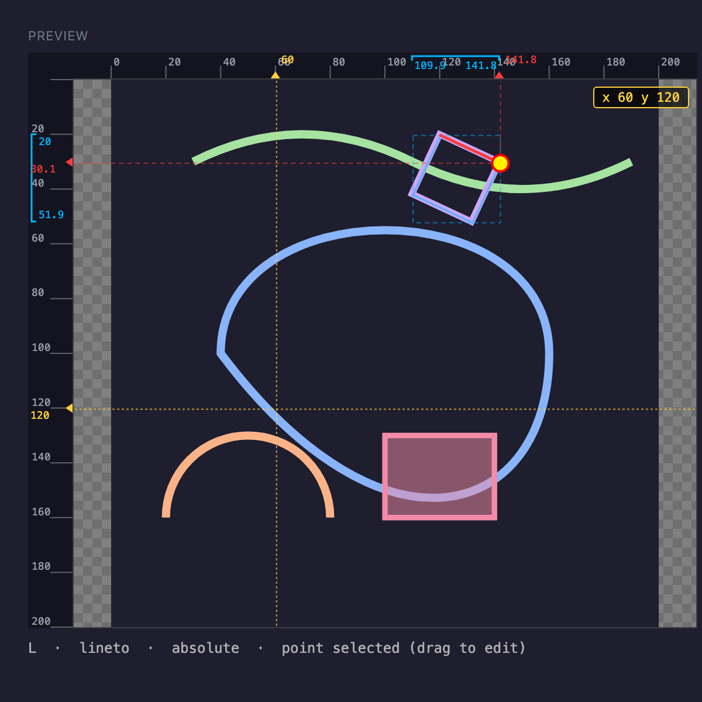

# SVG Path Helper

A VS Code extension for hand-writing and editing SVG paths: a live preview that
highlights the path segment under your cursor, cursor-aware syntax colouring
inside `<path d="…">`, draggable points, and absolute⇄relative conversion.



*Left: the `d` attribute coloured by the extension — command letters, end-point
and control-point coordinates, the segment under the cursor, and the selected
point. Right: the preview overlays the current path, the current segment, its
control points (with handles), and the selected end point.*

## Features

### Live preview
`SVG Path: Open Preview` (command palette, or the preview icon in the editor
title bar for `.svg` files) opens a panel beside the editor. Driven by the
cursor position, it overlays:

- the **current path** (faint blue outline);
- the **current segment** (red, thick);
- the **points of the current segment** — end point (red) and control points
  (orange, with dashed handles);
- the **selected point** (yellow, enlarged) when the cursor is on a coordinate.

The overlay is drawn through each path element's live CTM, so it tracks the
geometry **through parent `<g transform>`s and the path's own transform** —
translate, rotate, scale, skew, nested, all of it:



*The square lives inside `<g transform="translate(120 20) rotate(25) scale(0.6)">`.
The overlay (outline, red top edge, selected corner) stays locked to the rendered,
transformed shape.*

### Rulers & coordinate readout
Top and left rulers are calibrated to the root `viewBox` coordinate space and
indicate, with guide lines projected toward the rulers:

- the **bounding box of the whole current path** (cyan bracket + dashed box);
- the **current segment's next (end) point** (red caret + crosshair);
- the **live mouse position** (yellow caret + crosshair).

The mouse coordinates are also shown in a corner badge. For paths inside a
transform the indicators are projected into root coordinates, so the rulers stay
truthful even when the geometry is rotated or scaled (see the second screenshot).

### Cursor-aware syntax highlighting
Inside every `<path d="…">` the extension colours:

- segment **command letters** (`M`, `C`, `q`, …);
- the **coordinates of each end point** (one colour) and **control points**
  (another colour);
- the **segment under the cursor** (background highlight);
- the **point coordinates under the cursor** (strong highlight + bold).

These are editor *decorations*, recomputed live — they react to cursor movement,
which a static TextMate grammar cannot do.

### Drag points in the preview
Grab any point of the current segment in the preview and drag it — the matching
coordinate in the `d` attribute updates. The drag is committed as a **single
undo step** on release, and the cursor lands on the coordinate you edited.
Relative segments receive a delta from the segment start; `H`/`V` edit a single
number; arcs keep their `rx ry rotation large-arc sweep` flags.

### Absolute / relative conversion
Right-click in an `.svg`/XML/HTML file (or use the command palette):

- **Convert selected path(s) to Absolute coordinates** — easier for working
  with individual points.
- **Convert selected path(s) to Relative coordinates** — easier for moving
  groups of segments around.

Every `<path>` whose `d` attribute is touched by a selection (or contains a
cursor) is converted. Command kinds are preserved (`S` stays `S`, `H` stays
`H`); only letter case and numbers change. The first moveto is always kept
absolute, per the SVG convention.

## Develop / run

```bash
npm install
npm run build      # or: npm run watch
```

Then press **F5** ("Run SVG Path Helper") to launch an Extension Development
Host, open `example.svg`, run **SVG Path: Open Preview**, and move the cursor
through a `d` attribute (or drag a point in the preview).

The screenshots above are generated faithfully from the real `media/preview.*`
and the real parser via `tools/gen-demo.ts` (`node dist/gen-demo.js`) and
captured with headless Chrome.

## Settings

| Setting | Default | Description |
| --- | --- | --- |
| `svgPathHelper.precision` | `6` | Fractional digits kept when converting/dragging. |
| `svgPathHelper.colors.command` | `#4fc1ff` | Command letter colour. |
| `svgPathHelper.colors.endpoint` | `#e8d44d` | End-point coordinate colour. |
| `svgPathHelper.colors.control` | `#6a9955` | Control-point coordinate colour. |
| `svgPathHelper.colors.segmentBg` | `rgba(120,170,255,0.13)` | Current-segment background. |
| `svgPathHelper.colors.pointBg` | `rgba(255,220,0,0.30)` | Current-point background. |

## Supported path commands

`M L H V C S Q T A Z` in both absolute and relative forms, including implicit
repeated arguments (e.g. `M0 0 1 1 2 2`), smooth-curve control-point reflection
(`S`/`T`), and arc flag parsing.

## Known limitations

- The preview renders the document's outer `<svg>`. Inline SVG inside HTML/JSX,
  and files with several `<svg>` blocks, are handled as the first/outer one.

## License

MIT
